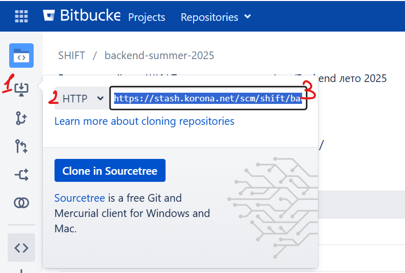
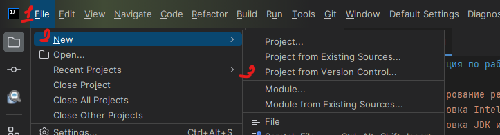
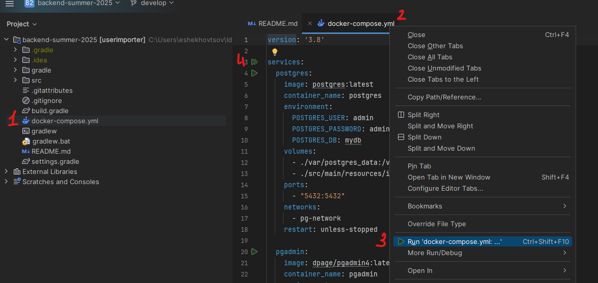
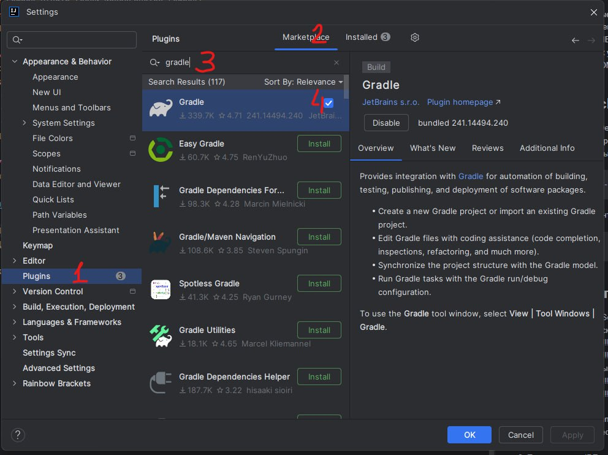
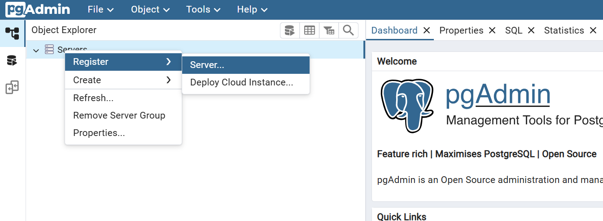
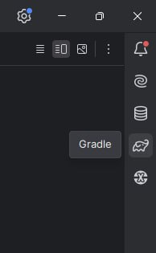
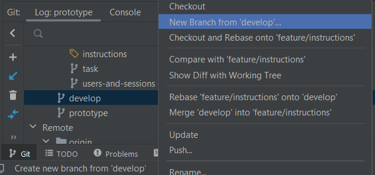
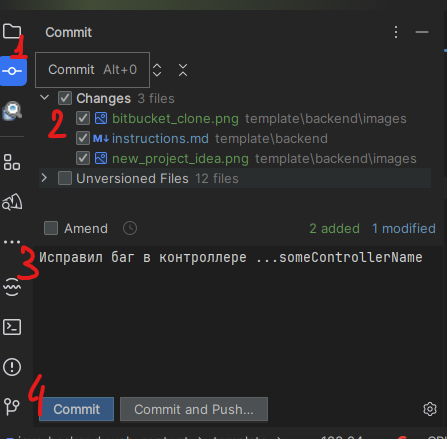
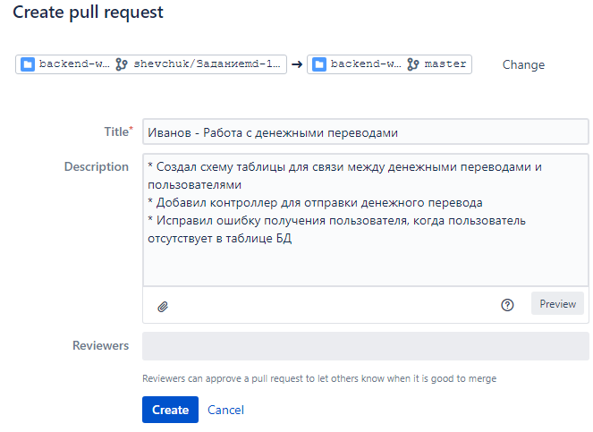

# Инструкция по запуску

1. [Клонирование репозитория из BitBucket](#1-клонирование-репозитория-из-bitbucket)
2. [Установка IntelliJ IDEA](#2-установка-intellij-idea)
3. [Установка JDK и настройка переменной JAVA_HOME](#3-установка-jdk-и-настройка-переменной-java_home)
4. [Запуск Docker](#4-запуск-docker)
5. [Установка плагинов в IntelliJ IDEA](#5-установка-плагинов-в-intellij-idea)
6. [Подключение к базе данных Postgres через pgAdmin](#6-подключение-к-базе-данных-postgres-через-pgadmin)
7. [Запуск Gradle задач](#7-запуск-gradle-задач)
8. [Выполнение запросов через Postman](#8-выполнение-запросов-через-postman)
9. [Приступая к разработке](#9-приступая-к-разработке)
   * [Создание веток](#создание-веток)
   * [Внесение изменений](#внесение-изменений)
   * [Создание Pull Request (PR)](#создание-pull-request-pr)
   * [Процесс Code Review (CR)](#процесс-code-review-cr)

---

## Требования к окружению

- Установленный и запущенный **Docker** и **docker-compose**
- Установленная **Java 17**

## 1. Клонирование репозитория из BitBucket

Скачайте Git c [официального сайта](https://git-scm.com/downloads) и установите.

### Клонирование через IDEA
1. На [странице проекта](https://stash.korona.net/projects/SHIFT/repos/backend-summer-2025/browse) скопировать ссылку на репозиторий;


2. В IDEA `File` > `New` > `Project from Version Control...`


3. В открывшемся окне в поле URL вставить скопированный URL и нажать **Clone**

### Клонирование через git bash

1. Откройте терминал git bash и выполните команду:
   ```bash
   git clone https://stash.korona.net/project/SHIFT/repos/backend-summer-2025.git
2. Перейдите в папку проекта
   ```bash 
   cd backend-summer-2025

---

## 2. Установка IntelliJ IDEA

1. Скачайте IntelliJ IDEA Ultimate версию c [официального сайта JetBrains](https://www.jetbrains.com/idea/download/?section=windows) и установите.
2. Запустите IntelliJ IDEA.

---

## 3. Установка JDK и настройка переменной JAVA_HOME

1. Скачайте JDK 17 с [официального сайта Oracle](https://www.oracle.com/java/technologies/javase/jdk17-archive-downloads.html) и установите.
2. Настройте переменную окружения JAVA_HOME для Windows:
* Откройте «Системные переменные» → Переменные среды.
* Создайте новую переменную:
   * Имя: JAVA_HOME
   * Значение: путь к установленному JDK (например, C:\Program Files\Java\jdk-17)
* Добавьте %JAVA_HOME%\bin в переменную Path.

---

## 4. Запуск Docker

Установка Docker

### Windows

- Требуется установленный **Docker Desktop**:  
  [Скачать Docker Desktop для Windows](https://www.docker.com/products/docker-desktop/)

- Во время установки Docker Desktop потребуется включить поддержку WSL 2. Следуйте инструкциям установщика.

### macOS

- Установите Docker Desktop:  
  [Скачать Docker Desktop для Mac](https://www.docker.com/products/docker-desktop/)

- Также можно установить через Homebrew:

  ```bash
  brew install --cask docker
  ```

### Linux

- Установите Docker и docker-compose через пакетный менеджер (пример для Ubuntu/Debian):

  ```bash
  sudo apt update
  sudo apt install docker.io docker-compose -y
  sudo systemctl start docker
  sudo systemctl enable docker
  ```

### Запуск из IDEA
1. Перейдите к файлу `./docker-compose.yml`
2. Нажмите ПКМ > `Run 'docker-compose.yml'`
3. Или запустите по зеленой иконке в самом файле (шаг 4 на скриншоте ниже)



### Запуск из cmd
1. Перейдите в папку проекта, где находится docker-compose.yml.
2. Запустите базу данных:
    ```bash
    docker-compose up -d
3. Проверьте статус контейнеров. Должен быть запущен контейнер postgreSQL:
    ```bash
    docker ps

После запуска будут доступны:

- PostgreSQL — порт 5432
- PgAdmin — порт 5050

## Доступ к сервисам

### PgAdmin

- URL: http://localhost:5050
- email: admin@example.com
- Пароль: admin

### PostgreSQL

- Хост: localhost
- Порт: 5432
- База данных: mydb
- Пользователь: admin
- Пароль: admin

## Важная информация

Конфликт портов с локальной PostgreSQL
Если у вас уже установлена локальная версия PostgreSQL, которая использует порт 5432, необходимо изменить внешний порт контейнера.

Для этого откройте файл docker-compose.yml и измените строку:

```
ports:
  - "5432:5432"
```

например, на:

```
ports:
  - "5433:5432"
```

Теперь контейнер будет доступен по порту 5433.

## Остановка контейнеров

Для остановки всех сервисов выполните:

```
docker-compose down
```

## Хранение данных

Контейнеры используют постоянные тома:

- ./var/postgres_data — данные PostgreSQL
- ./var/pgadmin_data — данные PgAdmin

Данные сохраняются между перезапусками контейнеров.

---

## 5. Установка плагинов в IntelliJ IDEA

1. Перейдите в File → Settings → Plugins.

   

2. Воспользуйтесь поиском и установите необходимые плагины. Если вы используете Community Edition, тогда предлагаем для удобства следующие плагины::
* Amplicode (пока еще бесплатный) https://amplicode.ru/download/#giga
* Spring Boot Assistant: для поддержки автодополнения в application.yaml (spring)
* Endpoints Explorer: для сканирования и навигации по REST API в spring приложениях
* Database Navigator или DatabaseHelper: для работы с БД (либо использовать pgAdmin)
* Docker: для работы с Docker
* Lombok: для поддержки Lombok
* MapStruct Support: для поддержки MapStruct

3. Перезапустите IDE после установки.

---

## 6. Подключение к базе данных Postgres через pgAdmin
### Если у вас запустился Docker compose из шага
Тогда pgAdmin уже установлен и работает из Docker.
Для его использования перейдите по адресу http://localhost:5050 и введите учетные данные:
* Логин: admin
* Пароль: admin

После успешного входа откроется интерфейс администрирования.

### Установка вручную
1. Скачайте pgAdmin с [официального сайта](https://www.pgadmin.org/download/) и установите.
2. Запустите pgAdmin и создайте новое подключение:
* Host name/address: localhost
* Port: 5432 (по умолчанию)
* Username и Password: указаны в docker-compose.yml
3. Нажмите Save и подключитесь. Вы увидите базу данных в дереве слева.

### Подключение к имеющейся БД
1. Нажмите ПКМ на `Servers` -> `Register` -> `Server`

   

2. Во вкладке General введите:

* `name` - название для сервера (может быть любым).

3. Во вкладке Connection (соединение) введите:

* `Host name / address`: localhost
* `Port`: 5432
* `Maintenance database`: mydb
* `Username`: admin
* `Password`: admin
---

## 7. Запуск Gradle задач

1. Откройте окно Gradle (иконка слона справа в IntelliJ).

   

2. Найдите нужную задачу (например, build).
3. Дважды кликните по задаче для её запуска. Также можно запускать из терминала:
    ```bash
    ./gradlew build

---

## 8. Выполнение запросов через Postman

1. Скачайте Postman с [официального сайта](https://www.postman.com/downloads/) и установите.
2. Запустите ваш backend-проект. Для проверки отправки запросов приложение должно быть запущено.
3. В Postman:
* Выберите метод (GET, POST, и т.д.)
* Введите URL, например: http://localhost:8080/api/example
* При необходимости добавьте тело запроса и заголовки.
4. Нажмите Send.
5. Результат появится в нижней части окна Postman.

---

## 9. Приступая к разработке

Вам необходимо иметь:

* Базовую ветку: фамилия/develop

### Создание веток

1. Склонируйте себе проект
2. Ветка, указанная в вашем выбранном варианте, является вашей начальной веткой
3. От начальной ветки необходимо создать свою базовую ветку:

* Через Intellij IDEA



* или выполнив команду `git checkout BRANCH_NAME develop`

Имя своей ветке задаёте как ivanov/develop, подставляя свою фамилию.

### Внесение изменений
#### Через IDEA
1. Откройте окно Commit на панели слева
2. Выберите файлы, которые хотите закоммитить
3. Введите осмысленное сообщение для коммита (ex. "Исправил NPE при пустом кошельке", "Исправил баг в контроллере ...someControllerName")
4. Нажмите `Commit`

   

5. После этого `Ctrl + Shift + K` > в открывшемся окне нажать `Push`.

#### Через git bash
1. После внесения изменений в проект проверьте статус файлов:
   ```bash
   git status
2. Добавьте нужные файлы в индекс:
    ```bash
    git add .
3. Или укажите конкретные файлы:
    ```bash
    git add src/Main.java
4. Сделайте коммит с описанием изменений:
    ```bash
    git commit -m "Исправил баг в контроллере ...someControllerName"
5. Отправьте изменения в удалённый репозиторий:
    ```bash
    git push

P.S. При первом `git push` Git запросит имя пользователя и пароль. Используйте логин и пароль и приветственного письма.

### Создание Pull Request (PR)
По готовности вашего кода к ревью:

1. Запуште вашу develop ветку в репозиторий
2. Переходите в удалённый репозиторий в раздел Pull requests. Создаете свой PR, нажав "Create pull request" справа сверху
3. В качестве Source-ветки выступает ваша develop-ветка (ex. ivanov/develop), в качестве Target-ветки выбирайте develop.
   На этом этапе также убедитесь в PR попало именно те коммиты/изменения, которые вы хотите отдать на ревью.
   Называйте коммиты осмысленно (ex. "Исправил NPE при пустом кошельке", "Исправил баг в контроллере ...someControllerName").
   Чем более осмысленный коммит и его описание - тем легче и быстрее пройдёт CodeReview (CR).
4. Жмёте "Continue"
5. Заполняете поля:

* Tittle: Фамилия - краткое описание изменений
* Description - Подробное описание изменений. Также можете прикладвать скриншоты/диаграммы и прочее к PR



6. Жмёте `Create`

### Процесс Code Review (CR)

После создания PR, дополнительно уведомите кураторов в чате о готовности к CR.
Далее всё общение по поводу PR происходит в самом PR.

Кураторы могут оставить вам замечания/вопросы по вашему коду. В случае необходимости исправления - правите в той же ветке у себя, коммитите новые изменения новым коммитом и пушите в репозиторий (не используйте force-push). Они автоматически подтянутся в PR